# Lore Master — Documentación de Arquitectura

> Documento técnico de referencia. Los diagramas usan [Mermaid](https://mermaid.js.org/)
> y se renderizan en GitHub, VS Code (con extensión), Obsidian y exportadores a PDF.

**Versión:** 1.0 · **Fecha:** 2026-06-02 · **Stack:** FastAPI · React 19 · Qdrant · Ollama

---

## Tabla de contenidos

1. [Visión general](#1-visión-general)
2. [Stack tecnológico](#2-stack-tecnológico)
3. [Arquitectura de contexto (C4)](#3-arquitectura-de-contexto-c4)
4. [Arquitectura de contenedores](#4-arquitectura-de-contenedores)
5. [Estructura del monorepo](#5-estructura-del-monorepo)
6. [Modelo de datos (ERD)](#6-modelo-de-datos-erd)
7. [Diagrama de clases — capas del backend](#7-diagrama-de-clases--capas-del-backend)
8. [Diagramas de secuencia](#8-diagramas-de-secuencia)
9. [Diagramas de flujo](#9-diagramas-de-flujo)
10. [Máquinas de estado](#10-máquinas-de-estado)
11. [Modelo de seguridad](#11-modelo-de-seguridad)
12. [Despliegue e infraestructura](#12-despliegue-e-infraestructura)
13. [Referencia de API](#13-referencia-de-api)
14. [Parámetros clave del sistema](#14-parámetros-clave-del-sistema)
15. [Arquitectura del frontend](#15-arquitectura-del-frontend)
16. [Borrado en cascada](#16-borrado-en-cascada-soft-delete--qdrant--archivos)
17. [Infraestructura de evaluación](#17-infraestructura-de-evaluación-harnesses)

---

## 1. Visión general

**Lore Master** es una herramienta RAG para *world-building* colaborativo (escritores,
creadores de RPG). Los usuarios suben documentos a **colecciones** y los consultan
mediante respuestas generadas por un LLM. Dentro de cada colección existen **entidades**
(personajes, criaturas, localizaciones, facciones, ítems) que acumulan **contenidos**
generados por RAG por categoría; confirmar un contenido auto-descarta los demás
pendientes de la misma categoría.

**Propuesta de valor:**
- **RAG de texto:** consulta de lore fundamentada en los documentos subidos.
- **RAG de imagen:** generación de imágenes a partir del lore (prompt construido por LLM).
- **Multi-tenant:** todo cuelga del usuario propietario; aislamiento por ownership.
- **Moderación multicapa:** guardrails léxicos + capa semántica opcional.

**Principios de diseño:** dominio puro, separación de capas (rutas → servicios →
dominio/engine → modelos), *soft-delete* en toda la capa de datos, e inferencia
LLM/imagen *self-hosted* (sin enviar datos de usuarios a terceros).

---

## 2. Stack tecnológico

| Capa | Tecnología |
|---|---|
| **Frontend** | React 19 · TypeScript (strict) · Vite 8 · React Router 7 · React Bootstrap 5 · `fetch` nativo |
| **Backend** | FastAPI · SQLModel · Pydantic Settings · Uvicorn |
| **LLM (texto)** | Ollama — `llama3.2:latest` (generación) · `mistral:latest` (prompts de imagen) |
| **Embeddings** | `sentence-transformers` — `paraphrase-multilingual-MiniLM-L12-v2` (384 dims) |
| **Vector DB** | Qdrant (distancia coseno, colección por `lm_{collection_id}`) |
| **Imagen** | ComfyUI (local) · RunPod Serverless (skeleton) · mock (tests) |
| **Moderación** | Guard léxico (regex) + Llama Guard 3 (semántico, fail-open) |
| **Base de datos** | SQLite (local) · PostgreSQL (Docker/prod) |
| **Caché / rate limit** | Redis |
| **Storage** | S3-compatible vía `boto3` — Floci (demo local) · Cloudflare R2 (cloud) |
| **Auth** | JWT local (cookies HttpOnly + CSRF) · Clerk (RS256) |
| **Reverse proxy** | Nginx (un solo puerto `:80`) |
| **Exposición pública** | Cloudflare Named Tunnel + TLS de borde |
| **Migraciones** | Alembic (auto-aplicadas en startup) |

---

## 3. Arquitectura de contexto (C4)

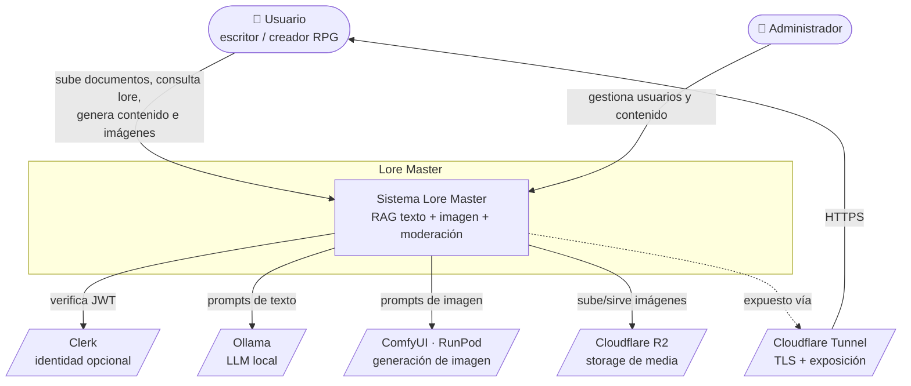

---

## 4. Arquitectura de contenedores

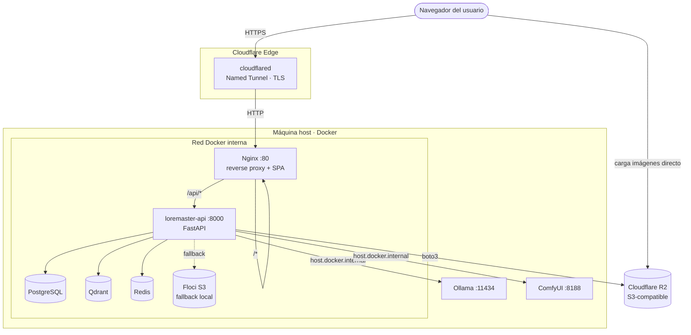

**Notas:**
- Un único puerto (`:80`) expuesto al host; backend, BD, vector store y caché son
  invisibles desde fuera de la red Docker.
- Las imágenes se sirven **directamente desde R2** (no pasan por Nginx ni el túnel).
- Ollama y ComfyUI corren en el host y se acceden vía `host.docker.internal`.

---

## 5. Estructura del monorepo

```
loremaster/
├── backend/                      # FastAPI + SQLModel + Qdrant + Ollama
│   ├── app/
│   │   ├── api/
│   │   │   ├── middlewares/       # rate_limit · security_headers
│   │   │   └── routes/            # auth · collections · documents · entities · images · public · admin · media
│   │   ├── core/
│   │   │   ├── auth/              # JWT · CSRF · dependencies · clerk
│   │   │   ├── config/            # Pydantic Settings
│   │   │   ├── database/          # mixins · soft_delete · utils
│   │   │   └── storage/           # S3 client · FileValidator
│   │   ├── domain/                # content_guard · llama_guard · prompt_templates · category_rules
│   │   ├── engine/                # rag · rag_pipeline · llm · extractor · comfyui_client · runpod_client
│   │   ├── models/
│   │   │   ├── db/                # SQLModel (tablas)
│   │   │   ├── schemas/           # Pydantic (request/response)
│   │   │   └── enums.py
│   │   └── services/              # lógica de negocio por dominio
│   └── evaluations/              # harnesses de evaluación (RAG, LLM, guard)
├── frontend/                     # React 19 + TypeScript + Vite
│   └── src/
│       ├── api/                  # clientes HTTP tipados
│       ├── components/ · pages/  # UI
│       ├── contexts/ · hooks/    # estado y lógica reutilizable
│       └── utils/                # enums · errores (ES) · formatters
└── docs/                         # arquitectura · planning · completed · history
```

---

## 6. Modelo de datos (ERD)

Todas las tablas de dominio usan **soft-delete** (`is_deleted` + `deleted_at`),
excepto `GeneratedText`, `GeneratedTextChunk` y `ModerationLog` (inmutables / append-only).

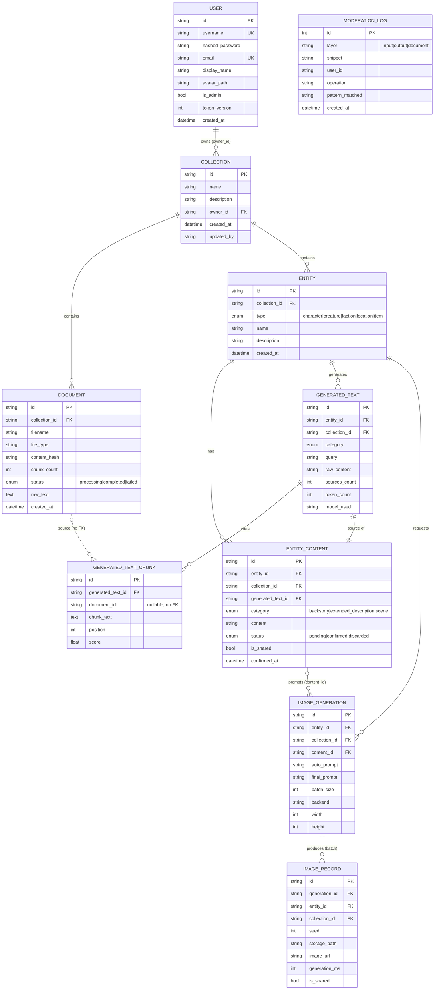

**Reglas de negocio clave:**
- `Collection.name` es único **por propietario** (`uq_collection_name_owner`).
- `Entity.name` es único **por colección** (`uq_entity_collection_name`).
- Un `EntityContent` referencia exactamente un `GeneratedText` (su origen inmutable).
- Confirmar un `EntityContent` auto-descarta los demás `pending` de la misma
  `(entity_id, category)`.
- `GeneratedTextChunk.document_id` no tiene FK dura: sobrevive al borrado del documento
  para preservar la auditoría de fuentes.

---

## 7. Diagrama de clases — capas del backend

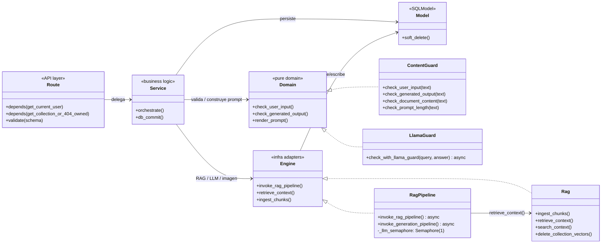

**Convención de capas:** las rutas nunca tocan el ORM directamente para lógica de
negocio; delegan en servicios. El dominio (`content_guard`, `prompt_templates`) es
puro y testeable sin I/O. El engine encapsula Qdrant, Ollama y ComfyUI.

---

## 8. Diagramas de secuencia

### 8.1 Autenticación (dual: JWT local + Clerk)

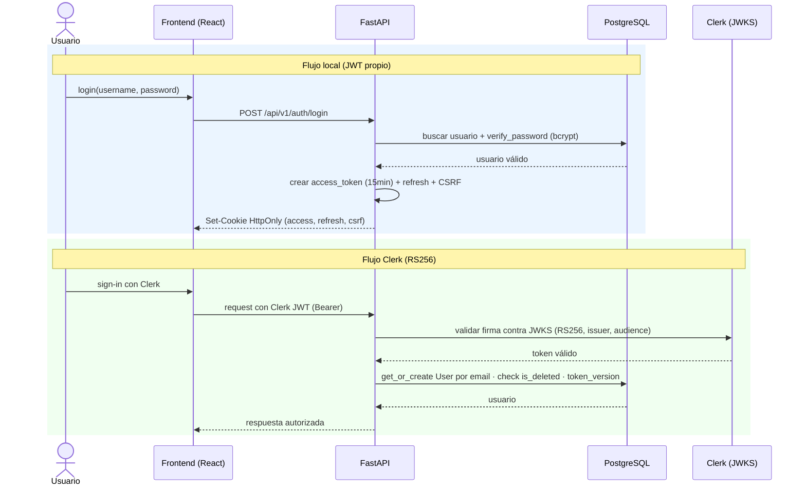

### 8.2 Ingesta de documento (extracción síncrona + embedding en background)

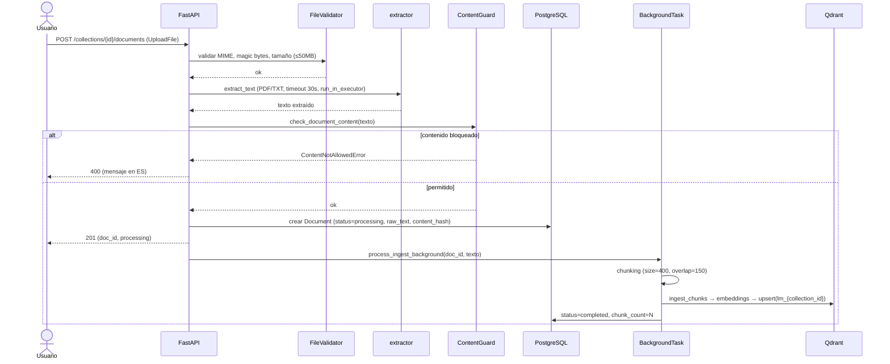

### 8.3 Generación de contenido RAG (con moderación multicapa)

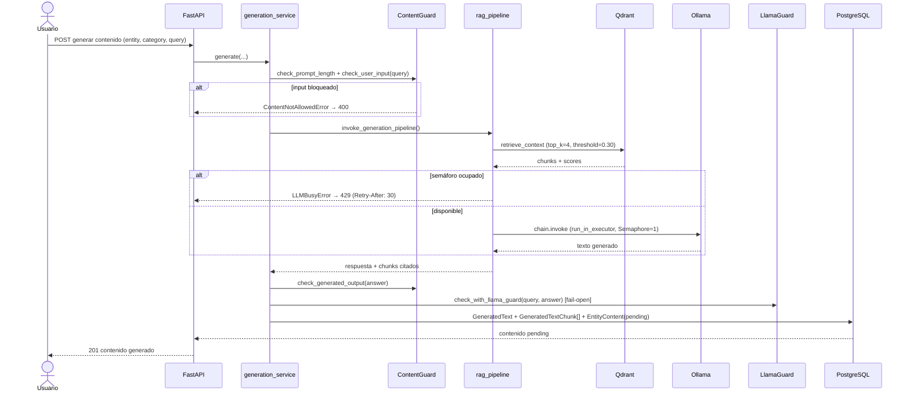

### 8.4 Generación de imagen (dos pasos)

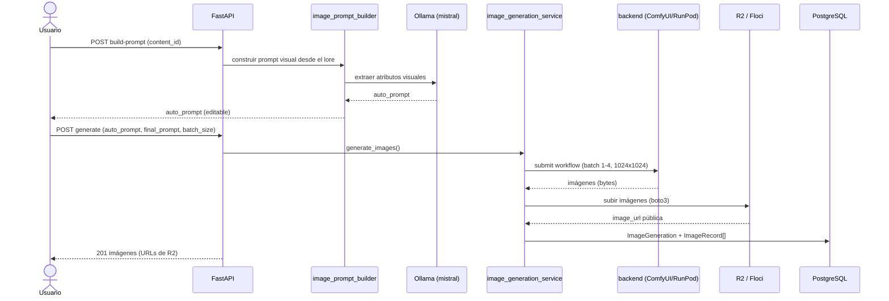

### 8.5 Refresh de token (proactivo + reactivo con coalescing)

El frontend renueva el access token de dos formas complementarias: **proactiva**
(`AuthContext` programa el refresh 60s antes de expirar) y **reactiva** (`apiClient`
intenta refrescar al recibir un 401). Múltiples 401 concurrentes comparten una única
promesa de refresh (singleton) para evitar N llamadas paralelas.

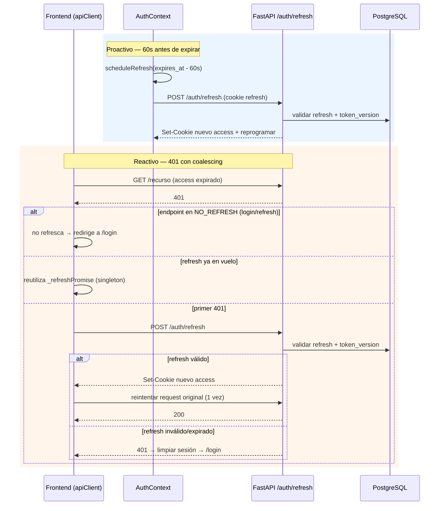

**Garantías:**
- La cookie de refresh está *scoped* a `/api/v1/auth/refresh` (no viaja en cada request).
- `token_version` permite invalidar todas las sesiones (logout global) de forma *timing-safe*.
- El *floor* mínimo entre refreshes evita bucles si el reloj del cliente está adelantado.

---

## 9. Diagramas de flujo

### 9.1 Pipeline RAG (ingesta → consulta)

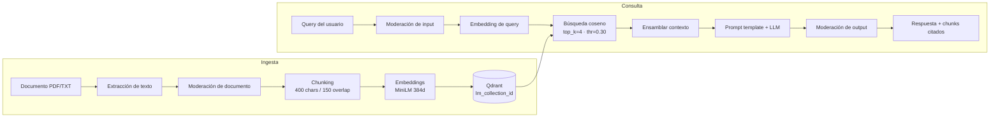

### 9.2 Pipeline de moderación (3 capas)

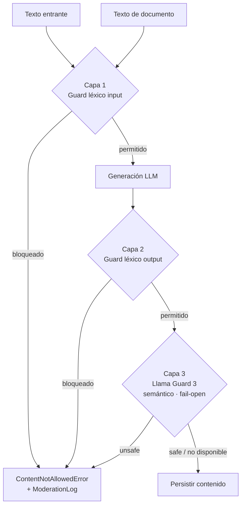

> La capa 3 es **fail-open**: si Llama Guard no está disponible, el contenido pasa
> (se registra) en lugar de bloquear el servicio. Activable con `LLAMA_GUARD_ENABLED=true`.

---

## 10. Máquinas de estado

### 10.1 Ciclo de vida del contenido de entidad

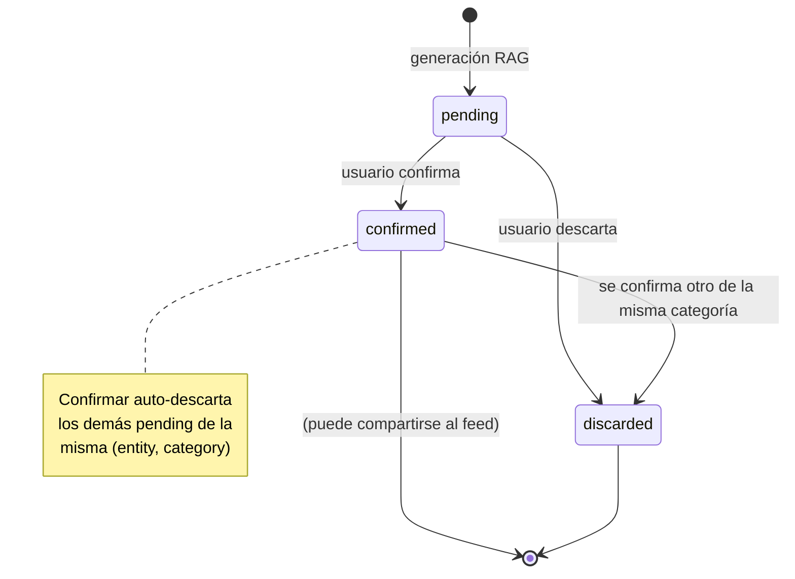

### 10.2 Estado de procesamiento de documento

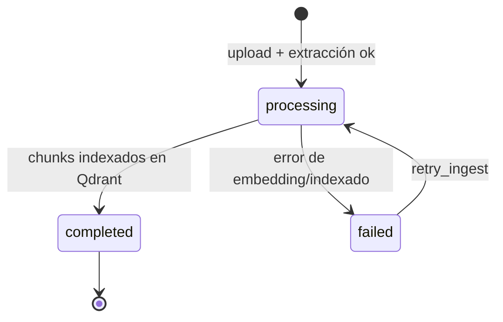

---

## 11. Modelo de seguridad

### 11.1 Capas de defensa

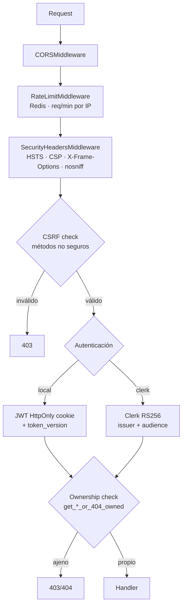

### 11.2 Controles implementados

| Control | Mecanismo |
|---|---|
| **Autenticación** | JWT local (cookies HttpOnly, access 15min + refresh 7d) o Clerk RS256 |
| **Revocación** | `token_version` con comparación *timing-safe* (`hmac.compare_digest`) |
| **CSRF** | Double-submit cookie; validado en POST/PUT/PATCH/DELETE |
| **Autorización** | Ownership por dependencia (`get_collection_or_404_owned`, etc.) — sin IDOR |
| **Rate limiting** | Middleware global + límites específicos para LLM e imagen |
| **Headers** | HSTS, CSP, X-Frame-Options DENY, X-Content-Type-Options nosniff |
| **Subida de archivos** | MIME + magic bytes + tamaño + límite de páginas PDF + strip EXIF |
| **Media** | Controller con auth + ownership; `is_shared` para feed público |
| **Path traversal** | `username` con regex estricta + contención bajo `media_root` |
| **Moderación** | 3 capas (input/output léxico + Llama Guard semántico) + `ModerationLog` |
| **Logging PII** | `PIIFilter` global redacta passwords, emails, tokens, secrets |
| **Concurrencia LLM** | `asyncio.Semaphore(1)` → HTTP 429 + `Retry-After: 30` |

---

## 12. Despliegue e infraestructura

### 12.1 Topología de despliegue (demo/portafolio)

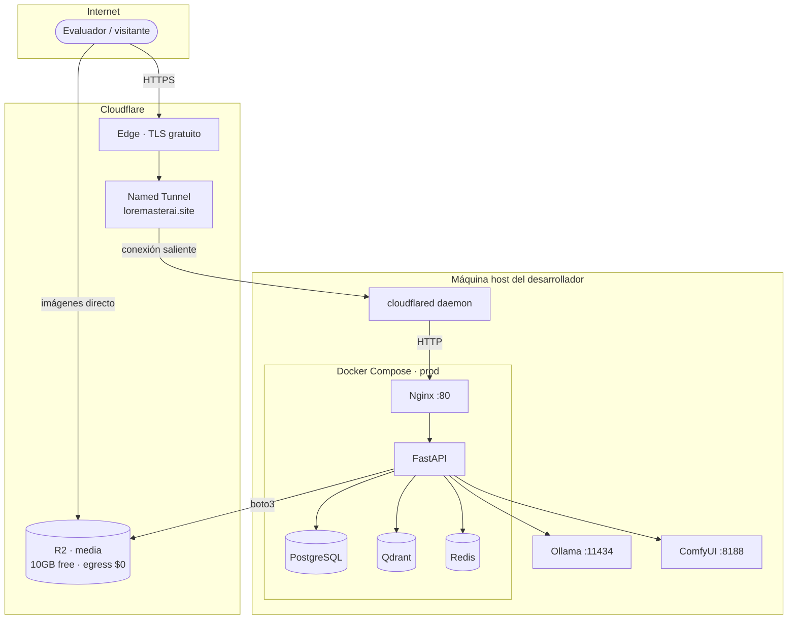

**Características del despliegue gratuito:**
- **Sin VPS ni port-forwarding:** `cloudflared` hace una conexión HTTPS saliente.
- **URL fija:** Named Tunnel sobre dominio propio (`loremasterai.site`).
- **TLS:** terminado en el borde de Cloudflare, sin tocar `nginx.conf`.
- **Storage:** Cloudflare R2 (S3-compatible, free tier 10 GB, egress $0).
- **Costo:** ~$0/mes (solo el dominio, ~$1-3/año).

### 12.2 Modos de ejecución

| Modo | BD | Storage | Imagen | Exposición |
|---|---|---|---|---|
| **local** | SQLite | filesystem | mock/ComfyUI | localhost |
| **demo (Docker)** | PostgreSQL | Floci / R2 | ComfyUI | Cloudflare Tunnel |
| **producción** | PostgreSQL | R2 | ComfyUI / RunPod | Named Tunnel + dominio |

---

## 13. Referencia de API

Todas las rutas bajo `/api/v1/`. Recurso raíz: **colecciones** →
`documents | entities → contents | images`.

| Dominio | Endpoints principales |
|---|---|
| **Auth (local)** | `POST /auth/login` · `POST /auth/register` · `POST /auth/refresh` · `POST /auth/logout` |
| **Auth (Clerk)** | `POST /auth/clerk/verify` · sincronización por email |
| **Colecciones** | `POST /collections` · `GET /collections` · `GET/DELETE /collections/{id}` · `POST /collections/bulk-delete` |
| **RAG query** | `POST /collections/{id}/query` (consulta libre fundamentada) |
| **Documentos** | `POST /collections/{id}/documents` · `GET .../documents` · `GET .../documents/events` (SSE) · `POST .../bulk-delete` · retry |
| **Entidades** | `POST /collections/{id}/entities` · `GET/PATCH/DELETE .../entities/{eid}` · `POST .../bulk-delete` |
| **Contenidos** | generar · confirmar · descartar · editar · compartir |
| **Imágenes** | `POST .../image-generation/build-prompt` · `POST .../image-generation/generate` |
| **Media** | `GET /media/...` (controller con auth + ownership) |
| **Público** | `GET /public/...` (feed de contenido/imágenes compartidos) |
| **Usuarios** | `GET/PATCH /users/me` · avatar · perfil público |
| **Admin** | gestión de usuarios y contenido (requiere `is_admin`) |
| **Modelos / metadata** | `GET /models` (Ollama) · `GET /metadata` |
| **Health** | `GET /health` (Qdrant + Ollama) |

---

## 14. Parámetros clave del sistema

| Parámetro | Valor | Dónde |
|---|---|---|
| `chunk_size` | 400 chars | RAG ingesta |
| `chunk_overlap` | 150 chars | RAG ingesta |
| `top_k` | 4 | RAG retrieval |
| `rag_score_threshold` | 0.30 (coseno) | RAG retrieval |
| `embedding_model` | `paraphrase-multilingual-MiniLM-L12-v2` (384d) | embeddings |
| `ollama_model` | `llama3.2:latest` | generación de texto |
| `image_prompt_model` | `mistral:latest` | prompts de imagen |
| `max_concurrent_llm_calls` | 1 (semáforo async) | concurrencia |
| `max_tokens` | 2000 | salida LLM |
| `temperature` | 0.7 | LLM |
| `max_pending_contents` | 5 | por entidad/categoría |
| `document_max_upload_mb` | 50 | subida de documentos |
| `max_pdf_pages` | 100 | anti PDF-bomb |
| `profile_image_max_size_mb` | 10 | avatares |
| `image` (default) | 1024×1024, batch 1-4 | generación |
| `access_token_expire_minutes` | 15 | JWT local |
| `refresh_token_expire_days` | 7 | JWT local |

---

## 15. Arquitectura del frontend

### 15.1 Componentes y flujo de datos

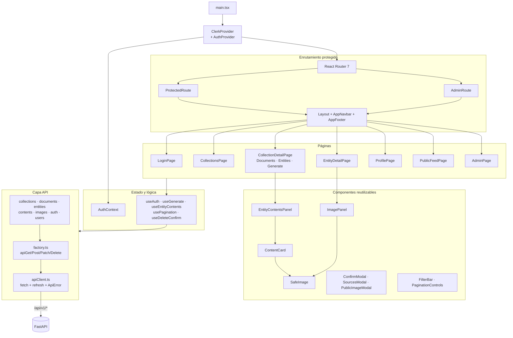

### 15.2 Decisiones de diseño del frontend

| Decisión | Detalle |
|---|---|
| **Sin librería de estado global** | `AuthContext` para sesión; estado local + hooks por feature |
| **`fetch` nativo** | Sin axios; `apiClient` centraliza errores y refresh |
| **Errores en español** | `utils/errors.ts` mapea status → mensaje descriptivo (nunca el código crudo) |
| **Abstracciones DRY** | `PaginationControls`, `FilterBar`, `useApiError`, `useFormSubmit`, `factory.ts` |
| **Seguridad de imágenes** | `SafeImage` + `isImageUrlAllowed` (allowlist de orígenes) con fallback |
| **Rutas protegidas** | `ProtectedRoute` (sesión) y `AdminRoute` (`is_admin` desde backend, no del JWT) |
| **Tabs divididos** | `CollectionDetailPage` separado en Documents/Entities/Generate para reducir tamaño de componente |

---

## 16. Borrado en cascada (soft-delete + Qdrant + archivos)

El borrado es **atómico**: las operaciones de soft-delete usan `commit=False` y se
confirman en una sola transacción; los efectos secundarios irreversibles (vectores
Qdrant, archivos en disco) se ejecutan con tolerancia a fallos parciales.

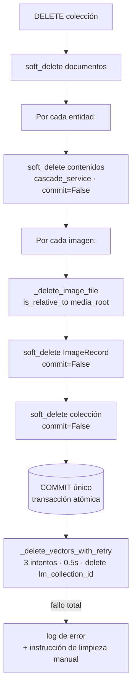

**Garantías y separación de responsabilidades:**

| Servicio | Responsabilidad |
|---|---|
| `cascade_service` | **Solo soft-delete** de `EntityContent` (BD), `commit=False` |
| `deletion_service` | Orquesta todo: soft-delete BD + **borrado físico** de archivos + **vectores Qdrant** |
| `_delete_image_file` | Borra el archivo validando `is_relative_to(media_root)` (anti path-traversal) |
| `_delete_vectors_with_retry` | Borra la colección Qdrant `lm_{collection_id}` con reintentos |

- El soft-delete (`is_deleted=True` + `deleted_at`) preserva la fila para auditoría.
- Si Qdrant falla tras agotar reintentos, la transacción de BD ya está confirmada y
  queda un log con instrucción de limpieza manual (los vectores huérfanos no afectan
  consultas porque el filtro de ownership ya excluye la colección).

---

## 17. Infraestructura de evaluación (harnesses)

La calidad del RAG, los parámetros del LLM, la calidad de prompts y la moderación se
miden con **harnesses** independientes bajo `backend/evaluations/`. Todos siguen el
mismo patrón **runner → judge → reporter**.

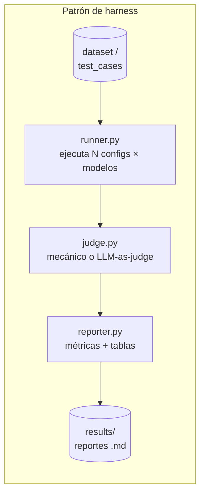

| Harness | Qué mide | Decisión derivada |
|---|---|---|
| `rag_params_harness` | `chunk_size`, `overlap`, `threshold`, `top_k` | 400 / 150 / 0.30 / 4 |
| `llm_params_harness` | `temperature`, `max_tokens` por categoría | uniformes (Δ neutral) |
| `prompt_harness` | calidad de los prompt templates | iteración de plantillas |
| `image_prompt_harness` | calidad del prompt visual construido | reglas en `image_prompt_rules` |
| `metadata_harness` | cabeceras de fuente en el contexto RAG | descartado (Δ marginal) |
| `guard_harness` | efectividad de moderación (adversarial/bypass/legítimo) | refuerzo de patrones |

**Jueces:**
- **Mecánico (J1):** ¿el guard tomó la decisión correcta? (bloqueó lo que debía).
- **LLM-as-judge (J2/J3):** severidad del contenido no bloqueado / falsos positivos,
  con un modelo independiente como evaluador.

> Los resultados (`results/`) y los datasets del guard se mantienen fuera del control
> de versiones. La metodología prioriza definir el umbral de adopción **antes** de
> ejecutar el harness para evitar sesgo de confirmación.

---

*Documento generado a partir de la lectura directa del código fuente (2026-06-02).
Para detalle operacional ver `docs/architecture/DEPLOY.md` y `DEPLOY-CLOUDFLARE.md`.*
