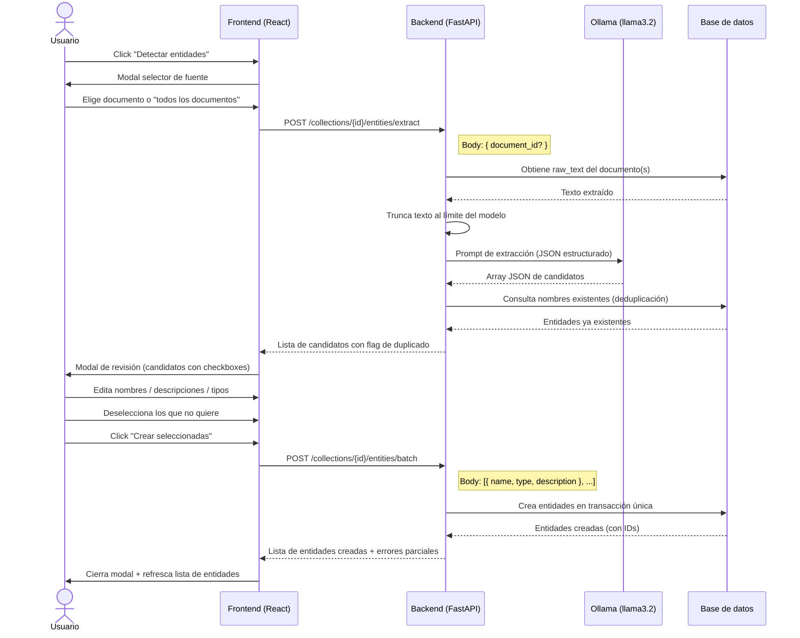
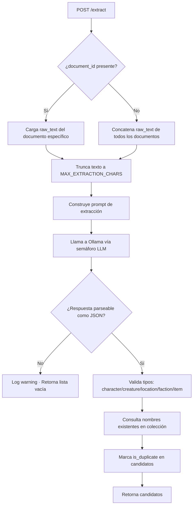
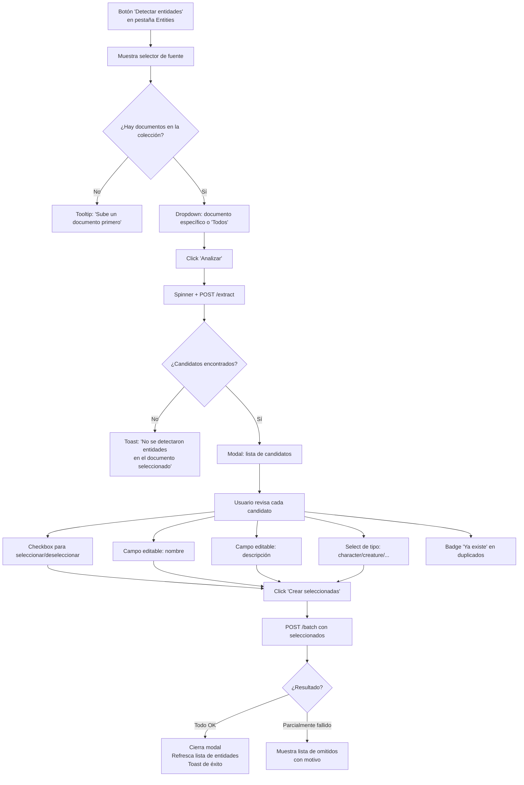
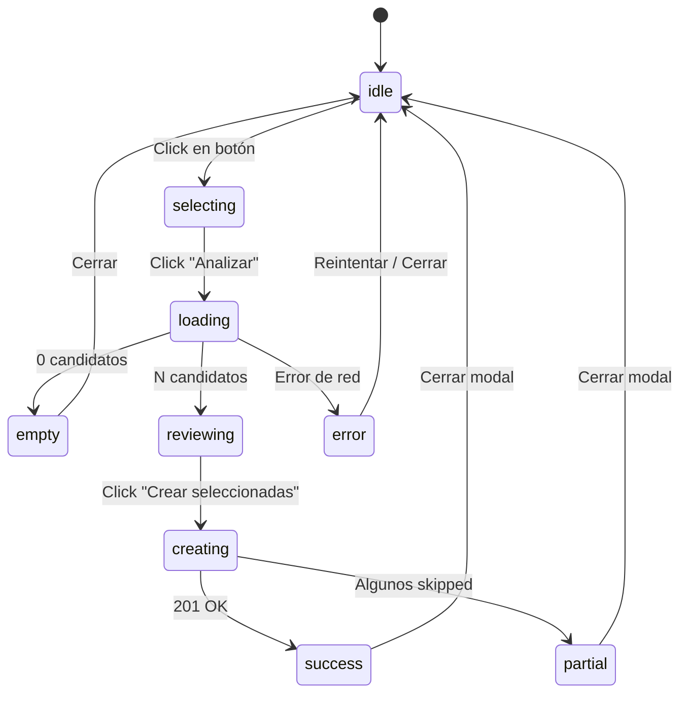

# Plan: Extracción automática de entidades desde documentos

**Estado:** En revisión — pendiente de aprobación  
**Fecha:** 2026-05-23  
**Alcance:** Feature nueva — no modifica flujos existentes  
**Motivación:** El feedback de usuario identificó que crear entidades una a una es tedioso. Se esperaba que cargar un PDF/TXT ya poblara los personajes y entidades automáticamente.

---

## 1. Resumen ejecutivo

Cuando el usuario sube un documento a una colección, el sistema ya extrae, indexa y vectoriza el texto. El LLM tiene acceso a ese contenido en el momento de la query. Sin embargo, las **entidades** (personajes, criaturas, lugares, facciones, ítems) deben crearse manualmente una a una.

Esta feature agrega un botón **"Detectar entidades"** en la pestaña Entities que, dado un documento (o todos los documentos de la colección), llama al LLM para extraer candidatos y los presenta al usuario en un modal de revisión. El usuario selecciona, edita y confirma; las entidades aprobadas se crean en una sola operación.

---

## 2. Problema y user story

> **Como** creador de mundos que ha subido un PDF con el lore de su historia,  
> **quiero** que el sistema detecte automáticamente los personajes, lugares y facciones del documento,  
> **para no** tener que crearlos uno a uno de forma manual.

**Dolor específico identificado en el feedback:**
- Crear entidades es lento y repetitivo.
- El usuario esperaba que subir el PDF ya "llenara" los personajes.
- El flujo actual no conecta la carga de documentos con la creación de entidades.

---

## 3. Principios de diseño

- **Acción explícita, no automática.** La extracción no ocurre en cada upload (agrega latencia silenciosa). El usuario la dispara cuando quiere.
- **Revisión antes de crear.** El LLM puede equivocarse. El usuario confirma, edita o descarta cada candidato.
- **Sin lógica de negocio nueva.** El batch creation reutiliza `create_entity_service` internamente.
- **Fail soft.** Si el LLM retorna JSON inválido o no detecta entidades, se muestra un mensaje claro; no es un error fatal.

---

## 4. Flujo completo



---

## 5. Backend

### 5.1 Endpoints nuevos

#### `POST /collections/{collection_id}/entities/extract`

Extrae candidatos de entidades usando el LLM. **No crea nada en la base de datos.**

**Request body:**
```json
{
  "document_id": "uuid-opcional"
}
```

Si `document_id` se omite, se concatenan los textos de todos los documentos de la colección (con separador).

**Response `200`:**
```json
[
  {
    "name": "Kael",
    "type": "character",
    "description": "Mago exiliado del norte, último superviviente de la Orden de Plata.",
    "is_duplicate": false
  },
  {
    "name": "Torre de Obsidiana",
    "type": "location",
    "description": "Antigua fortaleza volcánica donde el Consejo firmó el Tratado de Cenizas.",
    "is_duplicate": true
  }
]
```

**Errores:**
| Código | Situación |
|---|---|
| `404` | Colección o documento no encontrado / no pertenece al usuario |
| `422` | `document_id` con formato inválido |
| `200 []` | LLM no detectó entidades o retornó JSON inválido (fail soft) |

---

#### `POST /collections/{collection_id}/entities/batch`

Crea múltiples entidades en una sola transacción.

**Request body:**
```json
[
  { "name": "Kael", "type": "character", "description": "Mago exiliado..." },
  { "name": "Orden de Plata", "type": "faction", "description": "..." }
]
```

**Response `201`:**
```json
{
  "created": [ { ...entity }, { ...entity } ],
  "skipped": [
    { "name": "Torre de Obsidiana", "reason": "duplicate" }
  ]
}
```

Duplicados (mismo nombre en la colección) se omiten silenciosamente: no cortan la transacción, aparecen en `skipped`.

---

### 5.2 Flujo interno del endpoint `extract`



---

### 5.3 Prompt de extracción

```
Analiza el siguiente texto de lore y extrae todas las entidades del mundo ficticio mencionadas.

Para cada entidad devuelve un objeto JSON con estos campos exactos:
- "name": nombre propio exacto como aparece en el texto
- "type": uno de estos valores: character, creature, location, faction, item
- "description": descripción de 2 a 4 oraciones basada únicamente en lo que dice el texto

Reglas:
- Devuelve SOLO un array JSON válido. Sin texto adicional, sin markdown, sin explicaciones.
- Si no encuentras entidades, devuelve un array vacío: []
- No inventes información que no esté en el texto.

Texto:
{document_text}
```

---

### 5.4 Archivos a modificar / crear

| Archivo | Acción | Descripción |
|---|---|---|
| `app/domain/prompt_templates.py` | Modificar | Agregar `ENTITY_EXTRACTION_PROMPT` |
| `app/engine/llm.py` | Modificar | Agregar función `extract_entities_from_text()` |
| `app/services/entity/entity_service.py` | Modificar | Agregar `extract_entities_service()` y `batch_create_entities_service()` |
| `app/api/routes/entities/entities.py` | Modificar | Agregar rutas `/extract` y `/batch` |
| `app/models/schemas/entity.py` | Modificar | Agregar `ExtractRequest`, `ExtractedEntityCandidate`, `BatchCreateRequest`, `BatchCreateResponse` |
| `tests/test_entity_extraction.py` | Crear | Tests de los nuevos endpoints con mock LLM |

---

### 5.5 Constante nueva

```python
MAX_EXTRACTION_CHARS = 8_000  # ~2000 tokens — headroom para el prompt y el output
```

Se agrega a `Settings` y se documenta en `LIMITERS.md`.

---

## 6. Frontend

### 6.1 Flujo del modal



---

### 6.2 Componentes nuevos / modificados

| Archivo | Acción | Descripción |
|---|---|---|
| `src/api/entities.ts` | Modificar | Agregar `extractEntities()` y `batchCreateEntities()` |
| `src/types/entity.ts` | Modificar | Agregar `ExtractedCandidate`, `BatchCreateResponse` |
| `src/components/domain/EntityExtractionModal.tsx` | Crear | Modal de revisión de candidatos |
| `src/hooks/useEntityExtraction.ts` | Crear | Lógica de estado: candidatos, selección, edición, submit |
| `src/pages/CollectionDetailPage/EntitiesTab.tsx` | Modificar | Agregar botón "Detectar entidades" + integración del modal |

---

### 6.3 Estados del hook `useEntityExtraction`



---

## 7. Casos límite

| Caso | Comportamiento |
|---|---|
| Colección sin documentos | Botón deshabilitado con tooltip |
| LLM retorna JSON malformado | Lista vacía + mensaje informativo |
| Todos los candidatos son duplicados | Se muestran todos con badge "Ya existe"; el usuario decide si actualizar manualmente |
| Usuario selecciona 0 candidatos | Botón "Crear seleccionadas" deshabilitado |
| Documento muy largo (> `MAX_EXTRACTION_CHARS`) | Texto truncado silenciosamente; el LLM trabaja sobre el inicio del documento |
| Error de red en batch | Toast de error; modal permanece abierto para reintentar |

---

## 8. Lo que NO incluye este plan

- Actualización automática de entidades ya existentes con nueva información extraída.
- Extracción incremental (detectar solo entidades nuevas que no están en la colección).
- Edición de relaciones entre entidades.
- Soporte para formatos distintos a los ya soportados (PDF/TXT).

Estos quedan como posibles mejoras futuras, fuera del alcance de esta iteración.

---

## 9. Estimación de esfuerzo

| Área | Tarea | Esfuerzo |
|---|---|---|
| Backend | Prompt template + función LLM | 0.5 día |
| Backend | Servicios `extract` y `batch_create` + tests | 1 día |
| Backend | Endpoints + schemas | 0.5 día |
| Frontend | API client + tipos | 0.25 día |
| Frontend | Hook `useEntityExtraction` | 0.5 día |
| Frontend | Modal `EntityExtractionModal` | 1 día |
| Frontend | Integración en `EntitiesTab` | 0.25 día |
| **Total** | | **~4 días** |

---

## 10. Preguntas abiertas — a resolver antes de implementar

1. **¿Fuente de extracción?** — ¿El usuario siempre elige entre "un documento" vs "todos", o empezamos solo con "todos los documentos de la colección" para simplificar la primera versión?

2. **¿Qué hacer con duplicados?** — El plan actual los muestra con badge y deja decidir al usuario. ¿O prefieres que los duplicados directamente no aparezcan en el modal?

3. **¿Longitud de descripciones?** — El prompt pide 2-4 oraciones. El feedback mencionó que las descripciones podrían ser "más largas". ¿Un párrafo corto es suficiente o quieres un slider de longitud?

4. **¿Límite de candidatos?** — Si el LLM detecta 40 entidades, el modal puede ser largo. ¿Paginamos dentro del modal o mostramos todos?
