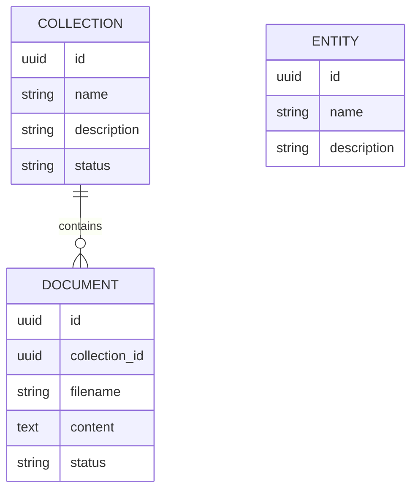
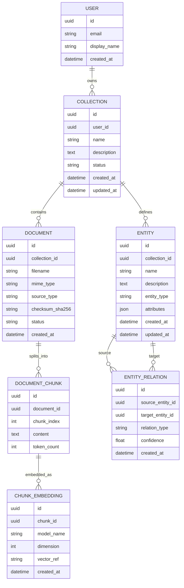

# Arquitectura, estructura y lineamientos de ERD

## 1) Estructura actual (mock)

La implementación usa diccionarios en memoria como almacenamiento:
- `collections = {}`
- `documents = {}`
- `entities = {}`

Relación implícita actual:
- 1 colección → N documentos
- entidades sin relación formal con colección/documento

## 2) ERD actual (representación conceptual)

> Nota: `ENTITY` existe en servicio/modelo, pero hoy no está integrada con persistencia relacional ni montada en `main.py`.

## 3) ERD objetivo sugerido (producción)

## 4) Comparación: actual vs objetivo

### Actual (mock)
- ✅ Muy rápido para prototipo.
- ❌ Sin persistencia.
- ❌ Sin auditoría temporal (`created_at`, `updated_at`).
- ❌ Sin claves/índices ni reglas referenciales.

### Objetivo (producción)
- ✅ Trazabilidad por usuario/colección/documento.
- ✅ Separación de chunking/embeddings para RAG real.
- ✅ Modelado formal de entidades y relaciones narrativas.
- ✅ Base para escalar queries y observabilidad.

## 5) Lineamientos y reglas de desarrollo (modelos/schemas/docs)

### Modelos de dominio
1. Todo modelo persistente debe incluir `id`, `created_at`, `updated_at`.
2. Estados (`status`) deben usar enums explícitos.
3. Relación entre tablas debe tener FK y comportamiento de borrado definido.

### Schemas API (Pydantic)
1. Separar request/response por caso de uso (no reutilizar modelo interno sin control).
2. Tipar respuestas con `response_model` en FastAPI.
3. Declarar validaciones (longitud, regex, límites) en `Field(...)`.
4. Estandarizar envelope de respuesta (`data`, `meta`, `errors`).

### Documentación viva
1. Si se cambia endpoint/modelo, actualizar README + docs en el mismo PR.
2. Mantener sección “Breaking changes”.
3. Añadir ejemplos mínimos de request/response por endpoint.

### Gobernanza técnica
1. Versionar API (`/api/v1`, `/api/v2`) al romper contratos.
2. Evitar lógica de negocio en rutas; mantenerla en `services/`.
3. Agregar pruebas de contrato para rutas críticas.
